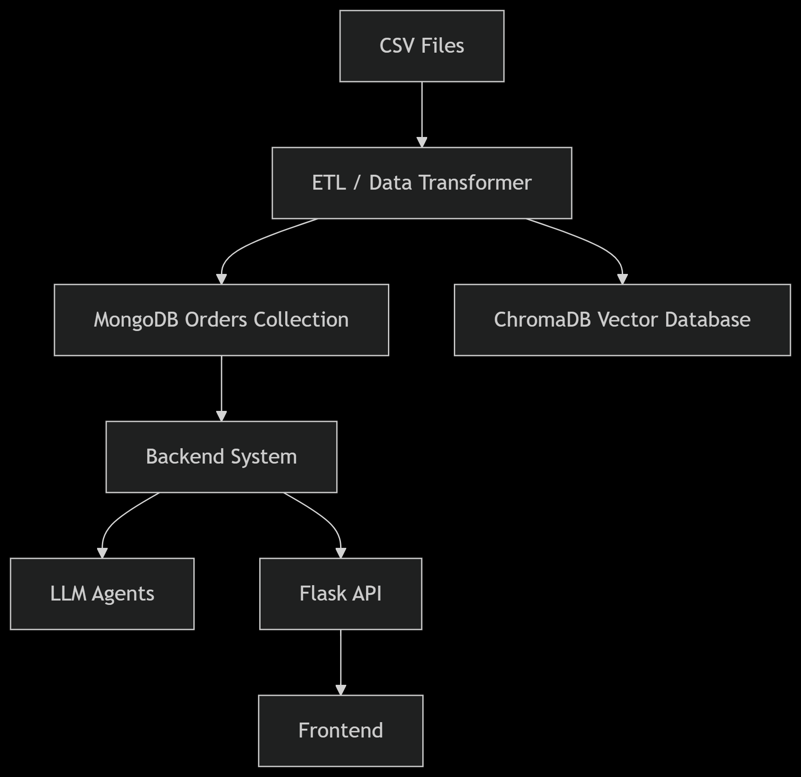
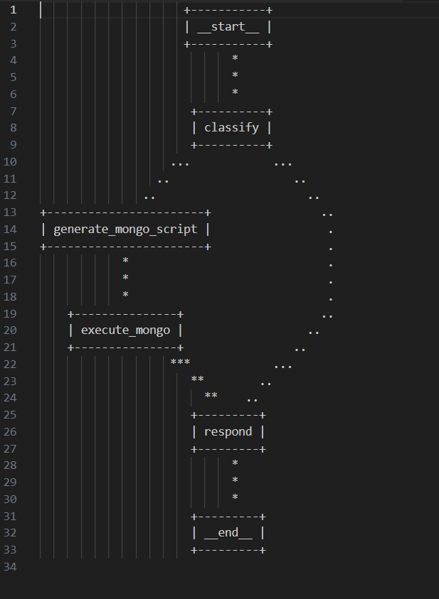
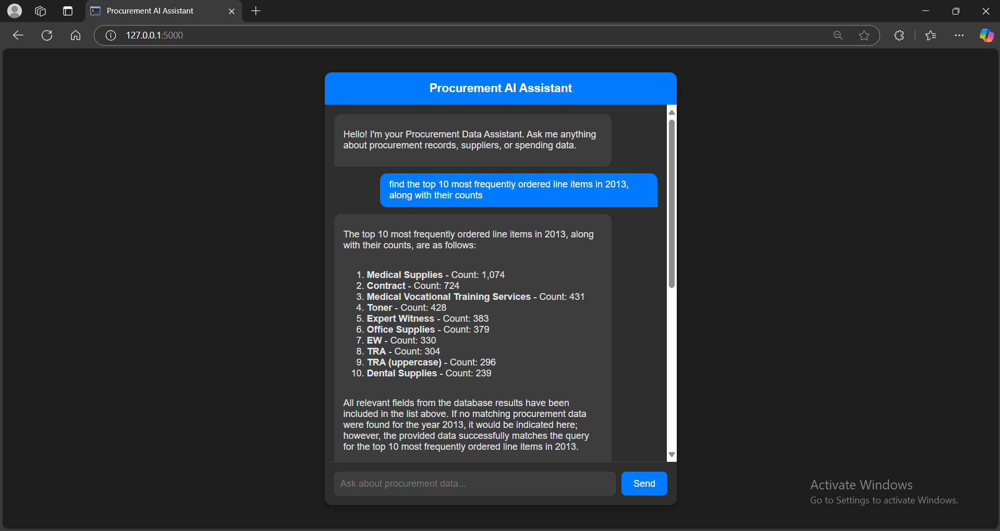

# Multi-Agent Procurement Assistant for Real-Time Data Insights

### Problem Description
Organizations managing extensive procurement operations often face challenges in efficiently extracting insights from large amounts of purchasing data. Important metrics such as order volumes, high-spending periods, and frequently ordered items are critical for informed decision-making, but manually analyzing this data can be labor-intensive and time-consuming.

This project addresses these challenges by developing an intelligent chat assistant that automates the retrieval of procurement insights. The assistant allows users to ask procurement-related questions and receive immediate, data-driven responses, empowering procurement teams to make faster and more informed decisions.

### Objective
To create a prototype assistant capable of answering queries related to procurement data. This includes:
- Total number of orders within specified periods.
- Identifying the quarter with the highest spending.
- Analyzing frequently ordered line items.
- Answering other relevant procurement-related inquiries.


## Project Overview
The Intelligent Procurement Assistant is a virtual assistant designed to streamline data-driven decision-making within procurement processes. This assistant allows procurement teams to interact with procurement data directly, answering questions about order trends, spending patterns, and frequently ordered items. By automating these insights, the assistant saves time and reduces the need for manual data analysis, empowering users to make faster and more informed purchasing decisions. 

## Dataset 
The dataset used in this project contains detailed procurement data, providing insights into purchasing trends, order volumes, and spending patterns. Key data points include:

- **Order Details**: Information on individual orders, including order numbers, dates, and amounts spent.
- **Time Periods**: Dates and timestamps that enable analysis by month, quarter, or year.
- **Items and Categories**: Details about the items purchased, including item descriptions, categories, and frequency of orders.
- **Spending Information**: Data on total spending per order, which allows for tracking of high-spending periods and analysis of spending trends over time.

This structured dataset is essential for powering the Intelligent Procurement Assistant you can find it through this link: https://www.kaggle.com/datasets/sohier/large-purchases-by-the-state-of-ca

## Technologies

- **Python 3.12**: The core programming language used for implementing the assistant's functionality, data processing, and handling user queries.
- **ChromaDB**: A library for efficient similarity search and clustering of dense vectors, enabling quick retrieval of relevant information from procurement data.
- **Flask**: A lightweight web framework used to create a user-friendly API that facilitates interaction between users and the assistant.
- **LangGraph**: A tool for building and visualizing graph-based workflows in applications that involve language models, enabling structured interaction and analysis of conversational flows.
- **Front-end**: user interface for UI chatbot using web languages like HTML, CSS, and JavaScript.

## How to run
### Prerequisites

# The folder named "Final_Chatbot" have full code to run the chat-bot application by main.py and the folder have back-end ,front-end and EDA modulus and notebooks.

---
- Install **Python 3.12** 
- Make sure you import **MongoDB** database collection.
- Ensure install .env file have the API Key to can execute language model.
---

### ETL

1- you first download the dataset form Kaggle and then run the "EDA with MongoDB.ipynb" to generate the cleaned and final Dataset and feed them to MongoDB Database.

- Run the ETL script directly:

python3 Final Chat-bot/EDA with MongoDB.ipynb

### Backend and Frontend
2.	In the main project folder, copy the .env.example file and rename it to .env:
```
cp .env.example .env
```
-	Update the .env file with your configuration values.
-	the .env have the API Key to can run enable the model work to generate
-	you must import the monogoDB data collection to enable the model see the data and chatting with him. 

## Architecture

The system is divided into three major components:

1. **ETL**: Handles data ingestion and transformation, as well as creating embeddings and storing data in both a document-oriented database and a ChromaDB vector.
2. **Backend**: Implements an agentic system to process user queries, orchestrate logic flows, and provide analytical or validated responses.
3. **Frontend**: Offers a simple, interactive user interface where users can converse with the assistant and obtain insights from the underlying data.


---

## ETL Process

1. **Data Reading**: Large CSV files containing procurement records are read in chunks.
2. **Transformation**: Each chunk undergoes cleaning, parsing, and validation steps, such as:
   - Converting date fields to standard formats.
   - Removing invalid or nonsensical values from numeric fields.
   - Fixing missing or skewed prices.
   - Normalizing text columns to a consistent format.
3. **Embedding Creation**: The transformed data—particularly item descriptions and commodity titles—undergoes embedding generation. These embeddings are stored in a ChromaDB vector index for efficient similarity search.
4. **Data Storage**:  
   - The structured procurement data (including line items) is stored in a MongoDB collection named **procurement_db**.  
   - The ChromaDB vector store holds the associated embeddings for quick retrieval.

This approach ensures that the dataset is consistent, accurate, and optimized for both analytical queries and similarity-based lookups.

---

## Backend

The backend is powered by a **Flask** server, which exposes an agentic system. This system, built using **LangGraph**, consists of various agents that coordinate to process user requests:

- **Classification Agent**: Analysis the user query and classify if "out of context" or "procurement related".
- **Generate Mongo scripts Agent**: Generate qureis algined with the user query to can query and find it in the database.
- **Execution Agent**: Executes final actions (e.g., database queries, computations) and returns results.

A directed graph (or state graph) connects these agents, defining how conversations flow and ensuring each user query follows the proper processing steps.



---

## Frontend

A **HTML/CSS and JavaScript** application serves as a simple user interface for interacting with the Procurement Data Assistant. Users can type in their questions or requests, and the system responds with relevant analytical insights drawn from the backend. This interface makes the analytical capabilities accessible to non-technical users.


---


## API Endpoint

The primary endpoint exposed by the Flask backend for conversational queries is:

GET
```
http://127.0.0.1:5000/
```

#### Request
```
find the top 10 most frequently ordered line items in 2013, along with their counts?

```


#### Response
```
The top 10 most frequently ordered line items in 2013, along with their counts, are as follows:

1-Medical Supplies - Count: 1,074
2-Contract - Count: 724
3-Medical Vocational Training Services - Count: 431
4-Toner - Count: 428
5-Expert Witness - Count: 383
6-Office Supplies - Count: 379
7-EW - Count: 330
8-TRA - Count: 304
9-TRA (uppercase) - Count: 296
10-Dental Supplies - Count: 239
All relevant fields from the database results have been included in the list above. If no matching procurement data were found for the year 2013, it would be indicated here; however, the provided data successfully matches the query for the top 10 most frequently ordered line items in 2013.

```

## Files:
# Final_Chatbot : full Project code have the back-end ,front-end and EDA modulus and notebooks.  
# code for agents : that file have code develop agents with langGraph and use integrate with LLM "GROK-2".
# Second Approach Transformer with chromaDB : this second approach I use but the accuracy is not aligned with the query and need big embeddings model with big vector database to can retrieve correct .

